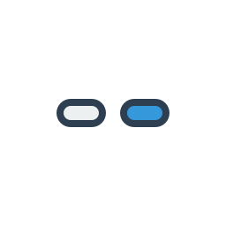

# 8BitDo M30 Bluetooth Gamepad Configuration for RetroArch on Windows

This guide provides step-by-step instructions for configuring the [8BitDo M30 Bluetooth](https://www.8bitdo.com/m30/) gamepad with [RetroArch](https://www.retroarch.com) on Windows.

## Prerequisites

Before you begin, ensure you have:

- An 8BitDo M30 Bluetooth gamepad
- A Windows PC with Bluetooth capability (built-in or USB adapter)
- RetroArch installed on your system
- Latest gamepad firmware (update using the [8BitDo Firmware Updater](https://support.8bitdo.com/firmware-updater.html))

## Configuration Steps

### 1. Enable X-Input Mode

1. Press and hold <kbd>X + Start</kbd> for 5 seconds
2. Verify that green LED lights 1 and 2 (bottom of gamepad) begin blinking

### 2. Pair the Gamepad with Windows

1. Press and hold the <kbd>Pair</kbd> button (top of gamepad) for 2 seconds
2. Open Windows Settings
3. Navigate to **Bluetooth & Devices**
4. Click **Add device** and select **Bluetooth**
5. Select **8BitDo M30 Bluetooth controller** from the list
6. Confirm successful pairing when the green LED becomes solid

### 3. Configure RetroArch Input

1. Launch RetroArch
2. Navigate to **Settings** > **Input** > **Port 1 Controls**
3. Set **Analog Digital Type** to **Left Analog**
4. Configure the following button mappings:

| Button | RetroArch Function | Gamepad Input |
|:------:|:------------------:|:-------------:|
|  | D-Pad Up | <kbd>Up</kbd> |
|  | D-Pad Down | <kbd>Down</kbd> |
|  | D-Pad Left | <kbd>Left</kbd> |
|  | D-Pad Right | <kbd>Right</kbd> |
|  | A Button (Right) | <kbd>C</kbd> |
|  | B Button (Down) | <kbd>B</kbd> |
|  | X Button (Top) | <kbd>Y</kbd> |
|  | Y Button (Left) | <kbd>A</kbd> |
|  | Select Button | <kbd>Select</kbd> |
|  | Start Button | <kbd>Start</kbd> |
|  | L Button (Shoulder) | <kbd>X</kbd> |
|  | R Button (Shoulder) | <kbd>Z</kbd> |

## Troubleshooting

### XYZ Buttons Not Working in Sega Emulator

**Issue**: XYZ buttons are unresponsive in Sega emulator.

**Solution**: Switch to the **Genesis Plus GX** core. Other cores may have compatibility issues with the XYZ buttons on this gamepad.

## Additional Resources

- [8BitDo M30 User Manual](https://download.8bitdo.com/Manual/Controller/M30/M30_Manual.pdf?20220513)
- [8BitDo M30 FAQ](https://support.8bitdo.com/faq/m30-bluetooth-controller.html)
- [8BitDo Firmware Updater](https://support.8bitdo.com/firmware-updater.html)

## Contributing

Contributions to improve this guide are welcome. Please feel free to submit a pull request.

## Support

If you found this guide helpful, please consider giving it a ⭐️.

## License

Copyright © 2023 [Alexander Danilenko](https://github.com/alexander-danilenko).