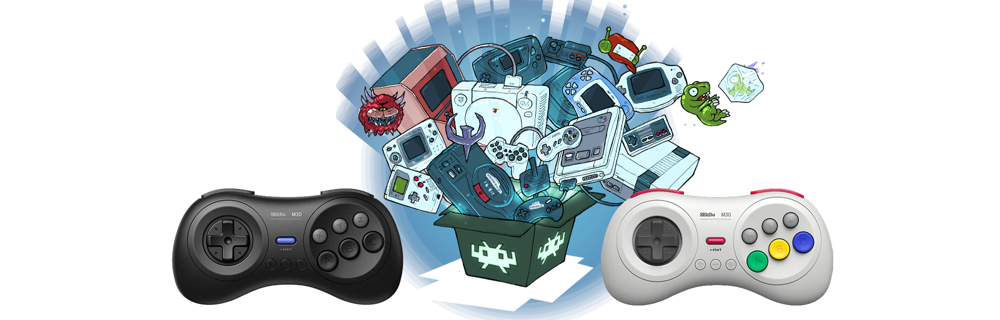

<h1 align="center"><a href="https://www.8bitdo.com/m30/" target="_blank">8BitDo M30 Bluetooth</a> gamepad  <a href="https://www.retroarch.com" target="_blank">Retroarch</a> configuration for Windows</h1>

Table of contents:
- [🔧 Prerequisites](#-prerequisites)
- [⚙️ Setup instructions](#️-setup-instructions)
- [🔫 Troubleshooting](#-troubleshooting)
- [💡 Useful links](#-useful-links)
- [🤝 Contribution](#-contribution)
- [⭐️ Show your support](#️-show-your-support)
- [📝 License](#-license)

## 🔧 Prerequisites
Before you start, make sure you have the following:
    
- 8BitDo M30 Bluetooth gamepad
- A Windows PC with Bluetooth (either the motherboard built-in adapter or a USB adapter)
- Retroarch software installed on your system
- Gamepad firmware up to date. Can be updated using [Firmware Updater tool](https://support.8bitdo.com/firmware-updater.html) via USB.

## ⚙️ Setup instructions

Follow these steps to set up your 8BitDo M30 Bluetooth gamepad for Retroarch on your Windows PC:

1. Put your gamepad to X-Input mode: 

   1.1. Press and hold <kbd>X + Start</kbd> `for 5 seconds`.

   1.2. Green led lights 1+2 (bottom of the gamepad) will start blinking.

2. Pair gamepad with PC:

   2.1. Press and hold <kbd>Pair</kbd> button (top of the gamepad) `for 2 seconds` to enter pairing mode.

   2.2. Open `Windows Settings`, navigate to `Bluetooth & Devices`, click on `Add device` and select `Bluetooth`.

   2.3. Select `8BitDo M30 Bluetooth controller` in the list of available bluetooth devides.

   2.4. Green led (bottom of the gamepad) will became solid when pairing successful.

3. Map RetroArch input:

   3.1. Launch `RetroArch` and go to `Settings`, then select `Input` and navigate to `Port 1 Controls`. 

   3.2. Set `Analog Digital Type` to `Left Analog`

   3.3 Set binding as following:

| RetroArch Key                 | Hardware Key    |
|:-----------------------------:|:---------------:|
|       |<kbd>Up</kbd>    |
|   |<kbd>Down</kbd>  |
|   |<kbd>Left</kbd>  |
| |<kbd>Right</kbd> |
|           |<kbd>C</kbd>     |
|           |<kbd>B</kbd>     |
|           |<kbd>Y</kbd>     |
|           |<kbd>A</kbd>     |
| |<kbd>Select</kbd>|
|  |<kbd>Start</kbd> |
|           |<kbd>X</kbd>     |
|           |<kbd>Z</kbd>     |

## 🔫 Troubleshooting

- **Problem**: XYZ buttons do not work in Sega emulator.

  **Solution**: Switch core to `Genesis Plus GX`. I found other cores incompatible with XYZ buttons for this gamepad.

## 💡 Useful links

- User Manual: https://download.8bitdo.com/Manual/Controller/M30/M30_Manual.pdf?20220513
- FAQ page: https://support.8bitdo.com/faq/m30-bluetooth-controller.html
- Controller Firmware Updater: https://support.8bitdo.com/firmware-updater.html

## 🤝 Contribution

If you want to contribute to this guide, feel free to create a PR.

## ⭐️ Show your support

Give a ⭐️ if this project helped you!

## 📝 License

Copyright © 2023 [Alexander Danilenko](https://github.com/alexander-danilenko).